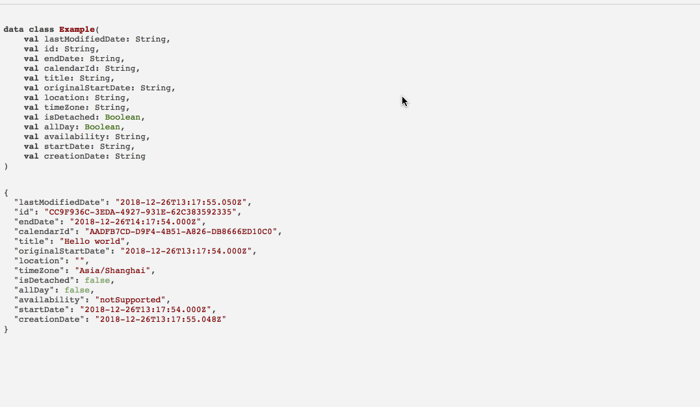

# JSON2Kotlin

Transfer json to kotlin dto class.  [Have a try](https://therollingstones.cn/JSON2Kotlin/)

`This project is simple and I only used about 2 hour to complete this. Don't complain too much haha🙈`

